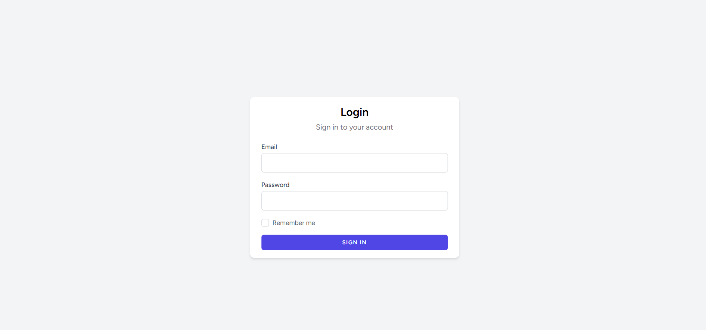
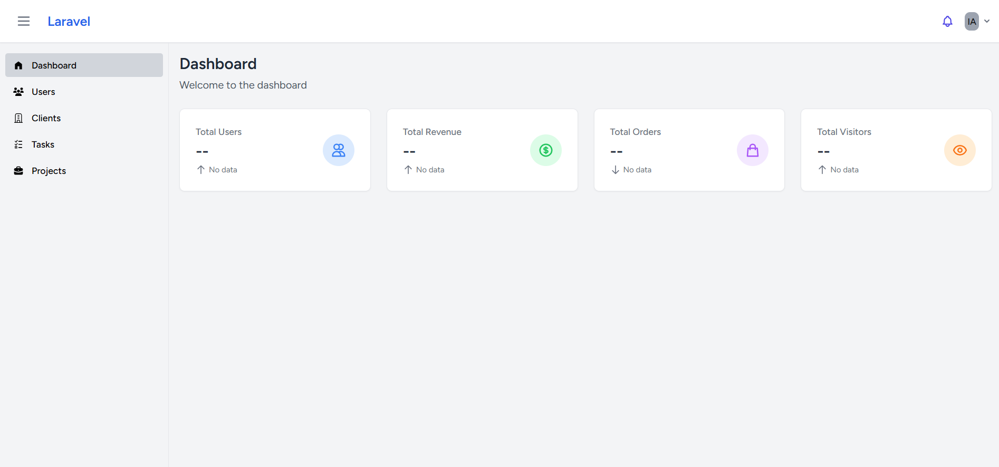
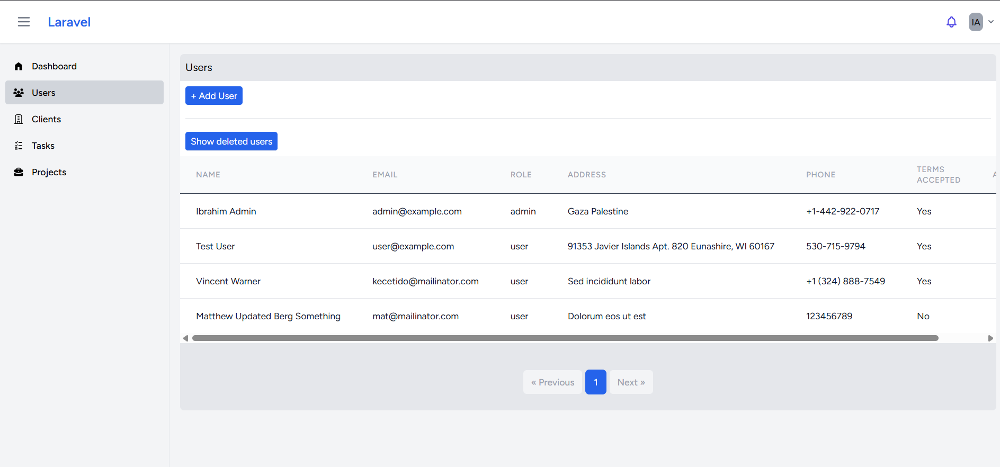
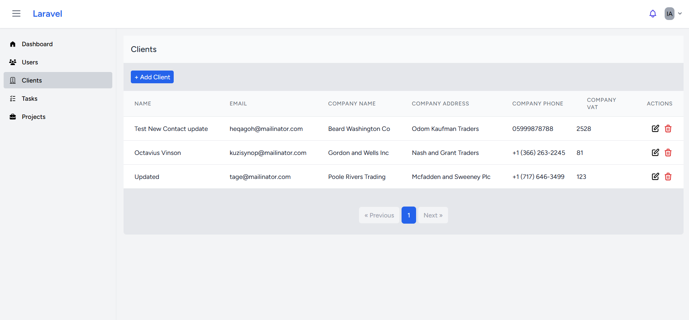
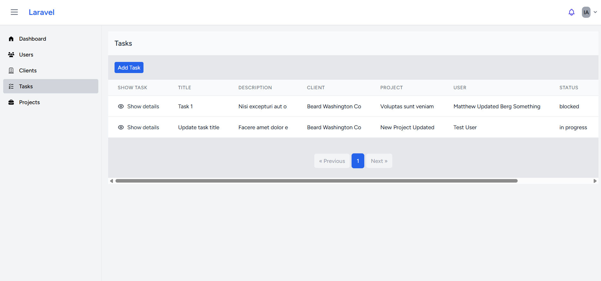
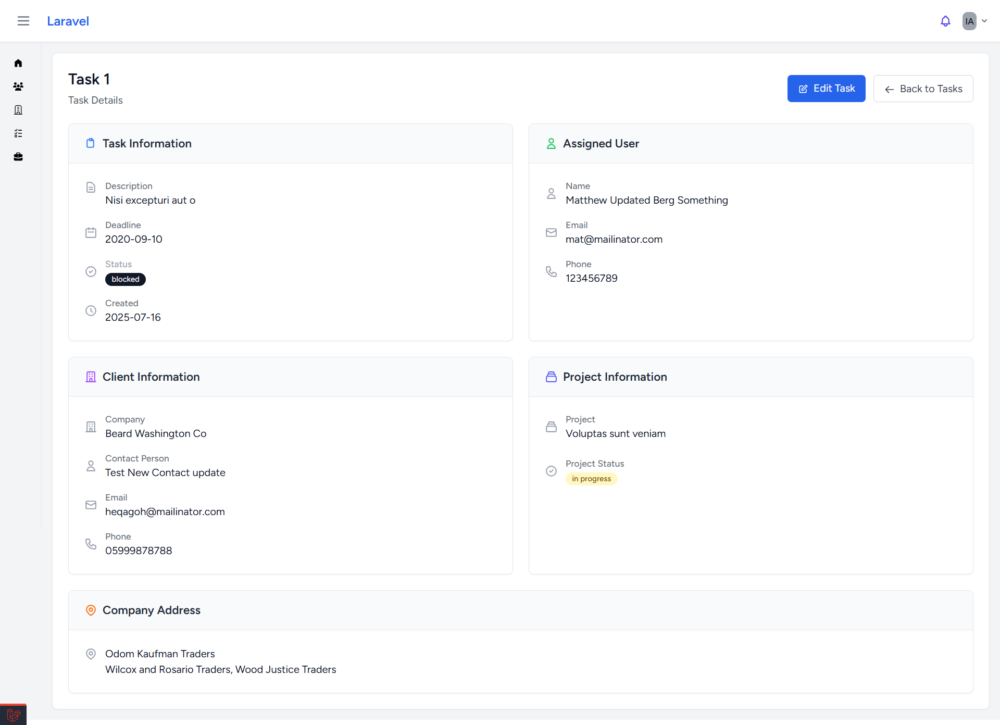
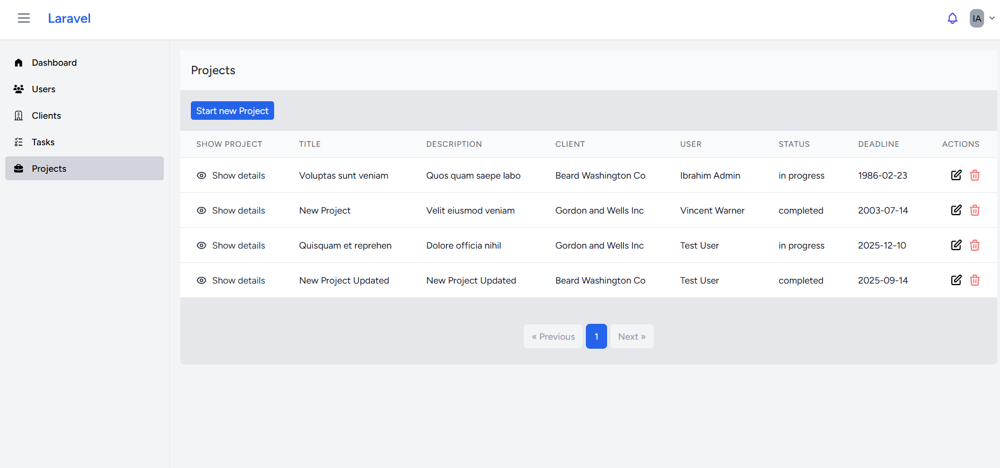
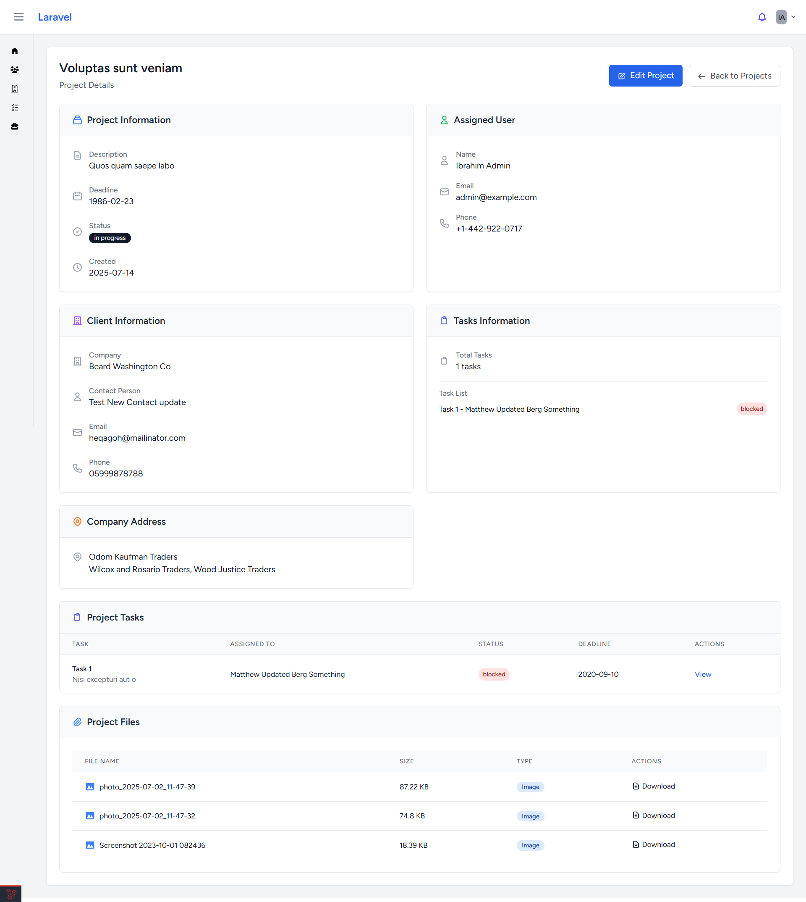

## About

A simple CRM project to use the skills I learned in Laravel & VueJS. I used InertiaJS to glue the integration between Laravel and VueJS

## Screenshots

## Features
- User role and permissions defined using Laravel Spatie
- Project Media is handled using Laravel Spatie Multimedia library
